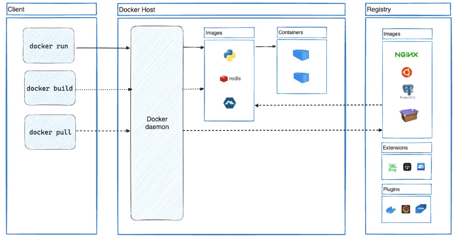

# Mister-Quiz

## Specifications 

We're joigning a development's team working on a quiz game web-application : they made the already existing code accessible through this link https://assets.01-edu.org/mister-quiz/mister_quiz.zip .
Our task is to complete the code in order to fulfill all the wanted requests.

### Project main goals

#### Authentication 

- Users should be able to register/login.
- Register : 
    - Username.
    - Email.
    - Password + confirmation.
- Login : 
    - Possible to login with either username/email.
    - Optionnaly possible to login using fb, instagram, google.
    - If credentials aren't correct : error message.
    - After logging in, user should be redirected to the home page.

#### Home page 

- Home page should have at least 3 buttons (for unlogged users) and 4 (for logged ones) :
    - Login/register : if the user's not logged in 
    - Profile
    - Leaderboard : list of the best players (XP amount)
    - StartQuiz
    - Logout

#### Quizz 

- StartQuiz :
    - Unlogged user : redirect to login page
    - Logged user : 
### Security

### Compatibility

- Must work on the main web browers (chrome, safari, Firefox, Edge).
- If we have enough time, doing a mobile app would be great.

## Epics/user stories/Back log : global features of the project 

### User stories 

The project started with the determination of the Main Epic and the different user stories.
The Epic represents the major objective of the project and the user stories the different features needed to respond to the customer's demands.
These user stories are prioritized to determine which ones we should do first : 
- High priority
- Moderate priority
- Low priority 

They also contain validation criteria to ensure that the functionality is correctly implemented.

## Data dictionary 

It details the database we use in our informative system. It’s used by devs & database admins, and is really helpful in its précise data description.

## MERISE Method

This method is useful to link the different elements of our project together. 
To follow this method we used the free Looping software which is intuitive and simple to apprehend.

###  Conceptual Data Model

Entities are represented by the Yellow rectangles and contain their different attributes.
Blue links associate the entities to each other when needed, they sometime have to contain some attributes as well, they also indicate how many times 2 Entities can be associated to each other : 
 - One to one (1,1) : Each entity occurrence is only linked to one occurrence of another entity.
- Zero or One to Many  (0,n) : One entity occurrence can be (or not) associated with several occurrences of another entity.

### Logical Data Structure 

It’s used to detail entity relations. The links defined in the CDM are translated into primary and foreign keys to establish the relations between tables : 
- Primary keys : Underlined & bold, unique attribute identifier.
- Foreign keys : Underline & bold but blue, reference to another table primary key.

### Physical Data Model

It’s the last step of the data modelisation in which the LDS is translated to data structures specific to the used database.

## Wireframe  

The Wireframe is like the Blueprint of the project, it can be divided in subgroups depending on its accuracy : 
- Low-fidelity : the most basic one
    - Layout
    - Navigation
    - Informative architecture 
- Mid-fidelity : 
    - Mapping out core functionalities/ key interactions
    - Adding annotation/content
- High-fidelity : It’s like a early mockup of the project 
    - Interactive/visual design elements
    - Fonts/colors/logos
    
We agree on the fact  the first draft isn’t definitive, it’ll evolve as we find more features to add and as we modify the structure.

### Low-Level

#### Mobile

#### Desktop

### Medium-Level

#### Mobile

#### Desktop

### High-Level 

## Technologies used 

### Back-End : PHP

- PHP is a server-side scripting language mainly used for web development. Despite its age, it has remained relevant and mwidely used :
    - It powers a large portion of the web including popular plateforms (WordPress, FB, Wikipedia..).
    - It's embedded in the LAMP stack (Linux, Apache, MySQL, PHP) a fundational setup for web servers.
- Structure/syntax : it's close to the one from C, Perl or JAVA.
- Interpretive : the code is runtime interpreted, not compiled beforehand, making it easy to deploy/modify.
- Platform independent : compatible with most major operating systems (Linux, Windows, MacOS).
- Supported databases : MySQL, PostgreSQL, Oracle, SQLite...
- Web server compatibility : works well with Apache, Nginx, IIS...
- Current version (PHP 8) : major improvements with the JIT (Just In Time) compiler which improves performances by compiling portions of the code directly to the machine code.
    - Newer features : type safety, detailed error handling, better support for object-oruented programming.

#### Why it's still used today

- Ease of use : simple to learn/use.
- Huge existing Codebase/Ecosystem : significant portion of websites still rely on it?
    - Large community support : extensive library of resources, frameworks (Laravel, Symfony) + large community for support.
    - We'll be using Laravel for our project.
- Web intregration options : integrates seamlessly with HTML, databases ... making it easy to build dynamic/data-driven websites.
- Fast development/prototyping : it's dynamic nature/compatibility with various frameworks allows to build applications quickly.
- Low cost/easy hosting : PHP-based hosting services are very affordable.
- Open-source/free.

#### Why we might prefer an other language 

- Security issues : PHP ease of use can make it easy to write insecure code
    - SQL injections
    - XSS attacks
- Simplicity can lead to messy code : PHP ease of use means that one can write code that's difficult to manage 
    - Some inefficient practises can affect maintainability.
- Performance limitations for High-Load Applications : performances might still be behind some languages (Node.js, Python, Go), for high-load real-time applications.
- Limited functionnal programming support : lacks support for some modern programming paradigms, like functional programming.

#### Server 

### Front-End : JS, HTML, CSS

- JS : Interactive User Interfaces creation
    - DOM (Document Object Model) manipulation
    - API calls (fetch)
    - Dynamic interactivity 
    - Handle SSE connections :
        - Create an EventSource : initiate EventSource Object with ther server endpoint URL that'll be provinding SSE data 
        - Listening for Events : The client listens for events sent by the server and each event triggers a JS function.
        - Updating Page : JS updates the webpage with new data by modifying the DOM to show the new messages, updates, notifications 
- Html : Standard web taging structure
- CSS :  Responsive Layout and interfaces design 

### Docker 

Docker is used to package and run an application in an isolated environment called a container, developers can work in a standardized environment. 
Containers are lightweight and contain everything needed to run the application.
It's possible to share the containers while working : ensures that everyone gets an application that works in the same way.

What we can do with Docker :
- Develop our application and its supporting components using containers
- The container becoles the unit for distributing and testing our application
- When ready : allows to deploy our application into our production environment as a container and an orchestrated service

#### Docker architecture 

Docker uses a Client-Server architecture :
- The Client : talks to the Docker Deamon
- The Deamon builds, runs and distributes our containers (can also communicate with other deamons)

The Docker Client and Deamon can run on the same system or we can connect a Client to a remote Deamon. They communicate using REST API(over Unix sockets or network interface)

### Database : SQLite 

- For the Database, we were asked to use SQLite, a C-language library that implements small, fast, self-contained high-reliability, full-featured SQL database engine.SQLite is built in every smartphone and most computers.
- SQLite file format is stable, cross-platform. SQLite database files are commonly used as containers to transfer rich content between systems & has a long term archival format for data 
- SQLite is not comparable to client-server SQL database engines because it provides local data storage for individual applications and devices. It competes with the Fopen() function.
- It works well as database engine for low to medium traffic websites (100K to 500K request/day).